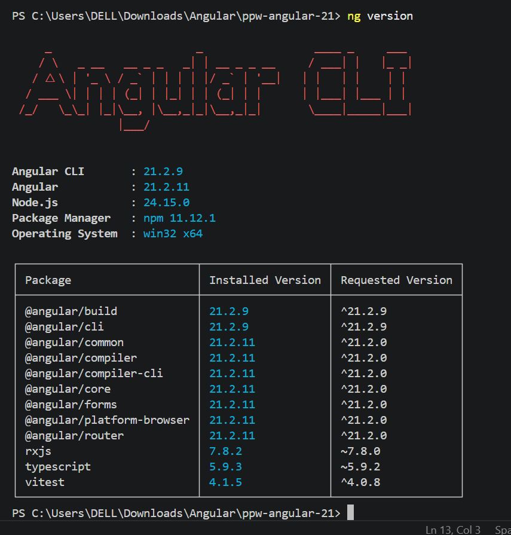
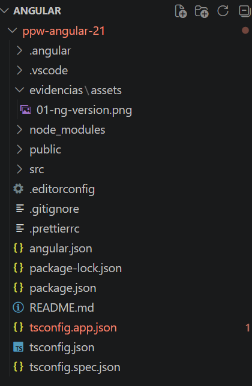
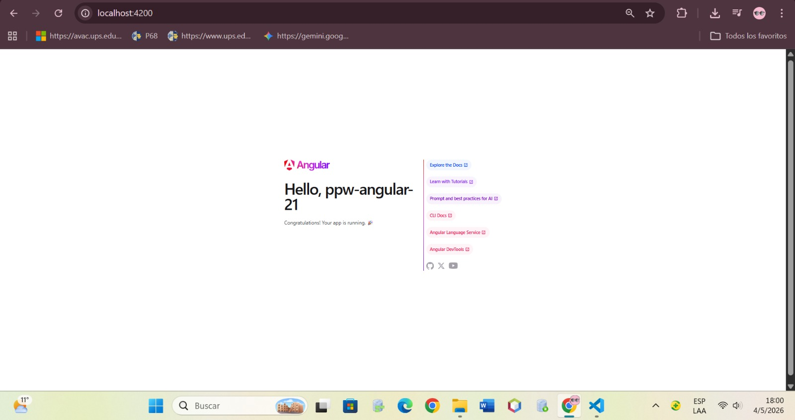
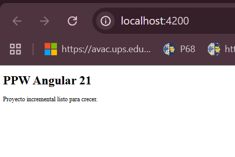
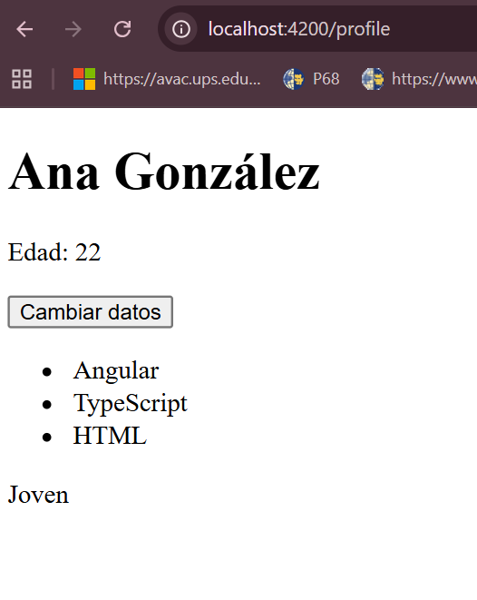

# PPW Angular 21
---

# Descripción del Proyecto

Este proyecto corresponde al desarrollo incremental de una aplicación web utilizando **Angular 21**, donde se implementan conceptos fundamentales del framework como routing, componentes standalone y manejo de estado reactivo.

El proyecto está diseñado para crecer progresivamente a lo largo de los módulos de la materia.

---

# Tecnologías Utilizadas

* Angular 21
* TypeScript
* SCSS
* Node.js
* npm

---

# Estructura del Proyecto

```
src/
  app/
    app.config.ts
    app.routes.ts
    app.ts
    features/
      home/
        pages/
          home-page.ts
      profile/
        pages/
          profile-page.ts
          profile-page.html
```

---

# Práctica 01: Instalación y Configuración

## Objetivo

Crear y configurar el proyecto base con Angular 21, habilitando routing y estableciendo una estructura organizada por features.

## Funcionalidades implementadas

* Creación del proyecto con Angular CLI
* Configuración de routing
* Uso de componentes standalone
* Estructura modular por features
* Página inicial (Home) funcional

## Evidencias

Ubicación: `evidencias/assets/`

* 01-ng-version.png


* 01-ng-new.png


* 01-app-inicio.png


* 01-home-page.png


## Resultado

El proyecto se ejecuta correctamente en el navegador y muestra la página inicial configurada.

---

# Práctica 02: Fundamentos de Angular

## Objetivo

Implementar funcionalidades modernas de Angular utilizando signals, computed y control flow dentro de una feature real.

## Funcionalidades implementadas

* Creación de la feature `profile`
* Manejo de estado con `signal()`
* Uso de `computed()` para valores derivados
* Actualización dinámica de datos con eventos
* Renderizado condicional con `@if`
* Iteración de listas con `@for`
* Control de flujo con `@switch`
* Navegación entre páginas

## Comportamiento de la aplicación

* Se muestra el nombre completo y edad
* Un botón permite cambiar los datos dinámicamente
* Se visualiza una lista de habilidades
* Se clasifica la edad automáticamente (Joven, Adulto, etc.)

## Rutas disponibles

* `/` → Página principal (Home)
* `/profile` → Página de perfil

## Evidencias

Ubicación: `evidencias/assets/`

* 02-profile-page.png


## Resultado

La aplicación permite interacción dinámica y navegación correcta entre páginas, aplicando correctamente los fundamentos modernos de Angular.

---

# Instalación y Ejecución

```bash
npm install
npm start
```

Abrir en el navegador:

http://localhost:4200

---

# Validaciones Cumplidas

* Proyecto Angular creado correctamente
* Aplicación ejecutándose sin errores
* Routing funcional
* Uso de componentes standalone
* Implementación de signals y computed
* Uso correcto de @if, @for y @switch
* Navegación entre páginas funcionando

---

# Conclusión

Se logró desarrollar una aplicación Angular funcional aplicando buenas prácticas de organización y programación reactiva, estableciendo una base sólida para continuar con los siguientes módulos del curso.

---

## Autor

Nombre: Cristina Loja 

Correo: clojap1@est.ups.edu.ec

